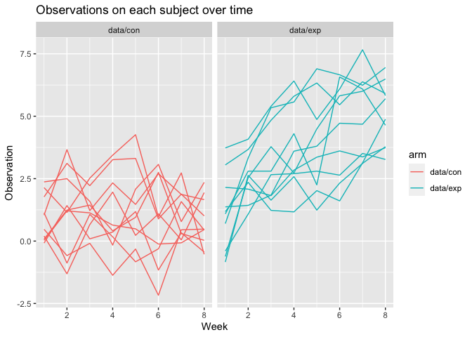

p8105\_hw5\_sl4658
================
Simin Ling
11/17/2020

## Problem 1

Load and describe the raw data.

``` r
homicide_raw = read_csv("./homicide-data.csv") 
```

    ## Parsed with column specification:
    ## cols(
    ##   uid = col_character(),
    ##   reported_date = col_double(),
    ##   victim_last = col_character(),
    ##   victim_first = col_character(),
    ##   victim_race = col_character(),
    ##   victim_age = col_character(),
    ##   victim_sex = col_character(),
    ##   city = col_character(),
    ##   state = col_character(),
    ##   lat = col_double(),
    ##   lon = col_double(),
    ##   disposition = col_character()
    ## )

``` r
head(homicide_raw)
```

    ## # A tibble: 6 x 12
    ##   uid   reported_date victim_last victim_first victim_race victim_age victim_sex
    ##   <chr>         <dbl> <chr>       <chr>        <chr>       <chr>      <chr>     
    ## 1 Alb-…      20100504 GARCIA      JUAN         Hispanic    78         Male      
    ## 2 Alb-…      20100216 MONTOYA     CAMERON      Hispanic    17         Male      
    ## 3 Alb-…      20100601 SATTERFIELD VIVIANA      White       15         Female    
    ## 4 Alb-…      20100101 MENDIOLA    CARLOS       Hispanic    32         Male      
    ## 5 Alb-…      20100102 MULA        VIVIAN       White       72         Female    
    ## 6 Alb-…      20100126 BOOK        GERALDINE    White       91         Female    
    ## # … with 5 more variables: city <chr>, state <chr>, lat <dbl>, lon <dbl>,
    ## #   disposition <chr>

There are 52179 rows/observations and 12 columns in the raw data. The
`homicide_raw` data includes information on the homicide report date and
location, the victim name, age and other demographic information, as
well as whether an arrest was made. Each row corresponds to a homicide
case being recorded.

Create a `city_state` variable and a `resolved` variable that represents
the disposition of homicide case

``` r
homicide_df =
  homicide_raw %>%
  mutate(
    city_state = str_c(city, state, sep = ", "),
    resolved = case_when (
      disposition == "Closed without arrest" ~ "unsolved",
      disposition == "Open/No arrest" ~ "unsolved",
      disposition == "Closed by arrest" ~ "solved",
    )
  ) %>%
  select(city_state, resolved) %>%
  filter(city_state != "Tulsa_AL")
```

Note: We drop Tulsa AL, because there is only one homicide case recorded
for this city.

Summarize within cities on the total number of homicides and the total
number of unsolved homicides

``` r
aggregate_df =  
  homicide_df %>% 
  group_by(city_state) %>% 
  summarize(
    hom_total = n(),
    hom_unsolved = sum(resolved == "unsolved")
  )
```

    ## `summarise()` ungrouping output (override with `.groups` argument)

``` r
aggregate_df
```

    ## # A tibble: 51 x 3
    ##    city_state      hom_total hom_unsolved
    ##    <chr>               <int>        <int>
    ##  1 Albuquerque, NM       378          146
    ##  2 Atlanta, GA           973          373
    ##  3 Baltimore, MD        2827         1825
    ##  4 Baton Rouge, LA       424          196
    ##  5 Birmingham, AL        800          347
    ##  6 Boston, MA            614          310
    ##  7 Buffalo, NY           521          319
    ##  8 Charlotte, NC         687          206
    ##  9 Chicago, IL          5535         4073
    ## 10 Cincinnati, OH        694          309
    ## # … with 41 more rows

For the city of Baltimore, MD, use the `prop.test` function to estimate
the proportion of homicides that are unsolved, apply `broom::tidy` to
this object, and pull the estimated proportion and CIs from the
resulting tidy dataframe.

``` r
baltimore_df = 
  prop.test(
    aggregate_df %>% filter(city_state == "Baltimore, MD") %>% pull(hom_unsolved), 
    aggregate_df %>% filter(city_state == "Baltimore, MD") %>% pull(hom_total)
  ) %>% 
  broom::tidy() %>% 
  select(estimate, conf.low, conf.high)

baltimore_df
```

    ## # A tibble: 1 x 3
    ##   estimate conf.low conf.high
    ##      <dbl>    <dbl>     <dbl>
    ## 1    0.646    0.628     0.663

Run `prop.test` for each city in the dataset `aggregate_df`, and extract
both the proportion of unsolved homicides and the confidence interval
for each.

``` r
results_df = 
  aggregate_df %>% 
  mutate(
    prop_tests = map2(.x = hom_unsolved, .y = hom_total, ~prop.test(x = .x, n = .y)),
    tidy_tests = map(.x = prop_tests, ~broom::tidy(.x))
  ) %>% 
  select(-prop_tests) %>% 
  unnest(tidy_tests) %>% 
  select(city_state, estimate, conf.low, conf.high)
```

    ## Warning: Problem with `mutate()` input `prop_tests`.
    ## ℹ Chi-squared approximation may be incorrect
    ## ℹ Input `prop_tests` is `map2(.x = hom_unsolved, .y = hom_total, ~prop.test(x = .x, n = .y))`.

    ## Warning in prop.test(x = .x, n = .y): Chi-squared approximation may be incorrect

``` r
results_df
```

    ## # A tibble: 51 x 4
    ##    city_state      estimate conf.low conf.high
    ##    <chr>              <dbl>    <dbl>     <dbl>
    ##  1 Albuquerque, NM    0.386    0.337     0.438
    ##  2 Atlanta, GA        0.383    0.353     0.415
    ##  3 Baltimore, MD      0.646    0.628     0.663
    ##  4 Baton Rouge, LA    0.462    0.414     0.511
    ##  5 Birmingham, AL     0.434    0.399     0.469
    ##  6 Boston, MA         0.505    0.465     0.545
    ##  7 Buffalo, NY        0.612    0.569     0.654
    ##  8 Charlotte, NC      0.300    0.266     0.336
    ##  9 Chicago, IL        0.736    0.724     0.747
    ## 10 Cincinnati, OH     0.445    0.408     0.483
    ## # … with 41 more rows

Create a plot that shows the estimates and CIs for each city

``` r
results_df %>% 
  mutate(city_state = fct_reorder(city_state, estimate)) %>% 
  ggplot(aes(x = city_state, y = estimate)) +
  geom_point() +
  geom_errorbar(aes(ymin = conf.low, ymax = conf.high)) +
  theme(axis.text.x = element_text(angle = 90, vjust = 0.5, hjust = 1)) +
  labs(x = "City, State", y = "Estimated proportion of unsolved homicides", title = "Estimated proportions and CIs of unsolved homicides for each city")
```

<!-- -->

## Problem 2

Import and tidy the data

``` r
data_1 = read_csv("lda_data/con_01.csv")
```

    ## Parsed with column specification:
    ## cols(
    ##   week_1 = col_double(),
    ##   week_2 = col_double(),
    ##   week_3 = col_double(),
    ##   week_4 = col_double(),
    ##   week_5 = col_double(),
    ##   week_6 = col_double(),
    ##   week_7 = col_double(),
    ##   week_8 = col_double()
    ## )

``` r
path_df = 
  tibble(
    path = list.files("lda_data")) %>% 
  mutate(
    path = str_c("lda_data/", path),
    data = map(path, read_csv)) %>%
  unnest(cols = data) %>%
  separate(path, into = c("file", "arm", "id"), sep = "_") %>% 
  select(-file) %>% 
  pivot_longer(
    week_1:week_8,
    names_to = "week",
    names_prefix = "week_",
    values_to = "observation") %>%
  mutate(
    arm = str_replace(arm, "data/", ""),
    arm = recode(arm, "con" = "control",
                      "exp" = "experiment"),
    id = as.character(id),
    id = as.numeric(str_replace(id, ".csv", "")),
    week = as.numeric(week, ".csv", ""))
```

    ## Parsed with column specification:
    ## cols(
    ##   week_1 = col_double(),
    ##   week_2 = col_double(),
    ##   week_3 = col_double(),
    ##   week_4 = col_double(),
    ##   week_5 = col_double(),
    ##   week_6 = col_double(),
    ##   week_7 = col_double(),
    ##   week_8 = col_double()
    ## )
    ## Parsed with column specification:
    ## cols(
    ##   week_1 = col_double(),
    ##   week_2 = col_double(),
    ##   week_3 = col_double(),
    ##   week_4 = col_double(),
    ##   week_5 = col_double(),
    ##   week_6 = col_double(),
    ##   week_7 = col_double(),
    ##   week_8 = col_double()
    ## )
    ## Parsed with column specification:
    ## cols(
    ##   week_1 = col_double(),
    ##   week_2 = col_double(),
    ##   week_3 = col_double(),
    ##   week_4 = col_double(),
    ##   week_5 = col_double(),
    ##   week_6 = col_double(),
    ##   week_7 = col_double(),
    ##   week_8 = col_double()
    ## )
    ## Parsed with column specification:
    ## cols(
    ##   week_1 = col_double(),
    ##   week_2 = col_double(),
    ##   week_3 = col_double(),
    ##   week_4 = col_double(),
    ##   week_5 = col_double(),
    ##   week_6 = col_double(),
    ##   week_7 = col_double(),
    ##   week_8 = col_double()
    ## )
    ## Parsed with column specification:
    ## cols(
    ##   week_1 = col_double(),
    ##   week_2 = col_double(),
    ##   week_3 = col_double(),
    ##   week_4 = col_double(),
    ##   week_5 = col_double(),
    ##   week_6 = col_double(),
    ##   week_7 = col_double(),
    ##   week_8 = col_double()
    ## )
    ## Parsed with column specification:
    ## cols(
    ##   week_1 = col_double(),
    ##   week_2 = col_double(),
    ##   week_3 = col_double(),
    ##   week_4 = col_double(),
    ##   week_5 = col_double(),
    ##   week_6 = col_double(),
    ##   week_7 = col_double(),
    ##   week_8 = col_double()
    ## )
    ## Parsed with column specification:
    ## cols(
    ##   week_1 = col_double(),
    ##   week_2 = col_double(),
    ##   week_3 = col_double(),
    ##   week_4 = col_double(),
    ##   week_5 = col_double(),
    ##   week_6 = col_double(),
    ##   week_7 = col_double(),
    ##   week_8 = col_double()
    ## )
    ## Parsed with column specification:
    ## cols(
    ##   week_1 = col_double(),
    ##   week_2 = col_double(),
    ##   week_3 = col_double(),
    ##   week_4 = col_double(),
    ##   week_5 = col_double(),
    ##   week_6 = col_double(),
    ##   week_7 = col_double(),
    ##   week_8 = col_double()
    ## )
    ## Parsed with column specification:
    ## cols(
    ##   week_1 = col_double(),
    ##   week_2 = col_double(),
    ##   week_3 = col_double(),
    ##   week_4 = col_double(),
    ##   week_5 = col_double(),
    ##   week_6 = col_double(),
    ##   week_7 = col_double(),
    ##   week_8 = col_double()
    ## )
    ## Parsed with column specification:
    ## cols(
    ##   week_1 = col_double(),
    ##   week_2 = col_double(),
    ##   week_3 = col_double(),
    ##   week_4 = col_double(),
    ##   week_5 = col_double(),
    ##   week_6 = col_double(),
    ##   week_7 = col_double(),
    ##   week_8 = col_double()
    ## )
    ## Parsed with column specification:
    ## cols(
    ##   week_1 = col_double(),
    ##   week_2 = col_double(),
    ##   week_3 = col_double(),
    ##   week_4 = col_double(),
    ##   week_5 = col_double(),
    ##   week_6 = col_double(),
    ##   week_7 = col_double(),
    ##   week_8 = col_double()
    ## )
    ## Parsed with column specification:
    ## cols(
    ##   week_1 = col_double(),
    ##   week_2 = col_double(),
    ##   week_3 = col_double(),
    ##   week_4 = col_double(),
    ##   week_5 = col_double(),
    ##   week_6 = col_double(),
    ##   week_7 = col_double(),
    ##   week_8 = col_double()
    ## )
    ## Parsed with column specification:
    ## cols(
    ##   week_1 = col_double(),
    ##   week_2 = col_double(),
    ##   week_3 = col_double(),
    ##   week_4 = col_double(),
    ##   week_5 = col_double(),
    ##   week_6 = col_double(),
    ##   week_7 = col_double(),
    ##   week_8 = col_double()
    ## )
    ## Parsed with column specification:
    ## cols(
    ##   week_1 = col_double(),
    ##   week_2 = col_double(),
    ##   week_3 = col_double(),
    ##   week_4 = col_double(),
    ##   week_5 = col_double(),
    ##   week_6 = col_double(),
    ##   week_7 = col_double(),
    ##   week_8 = col_double()
    ## )
    ## Parsed with column specification:
    ## cols(
    ##   week_1 = col_double(),
    ##   week_2 = col_double(),
    ##   week_3 = col_double(),
    ##   week_4 = col_double(),
    ##   week_5 = col_double(),
    ##   week_6 = col_double(),
    ##   week_7 = col_double(),
    ##   week_8 = col_double()
    ## )
    ## Parsed with column specification:
    ## cols(
    ##   week_1 = col_double(),
    ##   week_2 = col_double(),
    ##   week_3 = col_double(),
    ##   week_4 = col_double(),
    ##   week_5 = col_double(),
    ##   week_6 = col_double(),
    ##   week_7 = col_double(),
    ##   week_8 = col_double()
    ## )
    ## Parsed with column specification:
    ## cols(
    ##   week_1 = col_double(),
    ##   week_2 = col_double(),
    ##   week_3 = col_double(),
    ##   week_4 = col_double(),
    ##   week_5 = col_double(),
    ##   week_6 = col_double(),
    ##   week_7 = col_double(),
    ##   week_8 = col_double()
    ## )
    ## Parsed with column specification:
    ## cols(
    ##   week_1 = col_double(),
    ##   week_2 = col_double(),
    ##   week_3 = col_double(),
    ##   week_4 = col_double(),
    ##   week_5 = col_double(),
    ##   week_6 = col_double(),
    ##   week_7 = col_double(),
    ##   week_8 = col_double()
    ## )
    ## Parsed with column specification:
    ## cols(
    ##   week_1 = col_double(),
    ##   week_2 = col_double(),
    ##   week_3 = col_double(),
    ##   week_4 = col_double(),
    ##   week_5 = col_double(),
    ##   week_6 = col_double(),
    ##   week_7 = col_double(),
    ##   week_8 = col_double()
    ## )
    ## Parsed with column specification:
    ## cols(
    ##   week_1 = col_double(),
    ##   week_2 = col_double(),
    ##   week_3 = col_double(),
    ##   week_4 = col_double(),
    ##   week_5 = col_double(),
    ##   week_6 = col_double(),
    ##   week_7 = col_double(),
    ##   week_8 = col_double()
    ## )

Create a spaghetti plot showing observations on each subject over time

``` r
spaghetti = 
  path_df %>%
  ggplot(aes(x = week, y = observation, group = id, color = arm)) + 
  geom_line() + 
  facet_grid(. ~arm) +
  labs(
    x = "Week",
    y = "Observation",
    title = "Observations on each subject over time"
  )

spaghetti
```

<!-- -->

As shown in the graph, the observations on subjects in both control and
experiment groups started from a relatively close value at week 0. The
experiment group experienced an increasing trend in observation across
time, while the control group remained relatively stable over the study
time.
